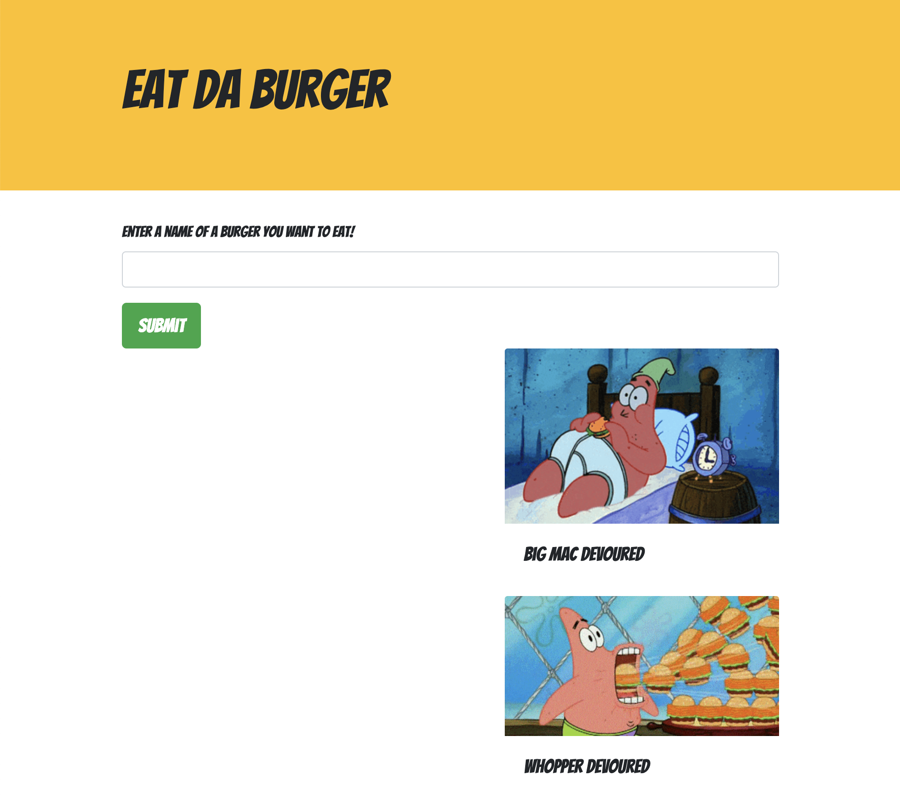

# Eat Da Burger 

## Description

Eat-da-burger is a web page where the user enters the burger he or she wants to eat and then devours it! It is created using express.js using a MySQL database.

Deployed Site: <https://evening-chamber-54039.herokuapp.com/>

## Table of Contents

* [Installation](#installation)
* [Usage](#usage)
* [License](#license)

## Installation

clone this Repo. Visit the deployed page link.

## Usage

## License

Licensed under MIT License.

## Questions

Contact [mc4506](mailto:mike4506@gmail.com)